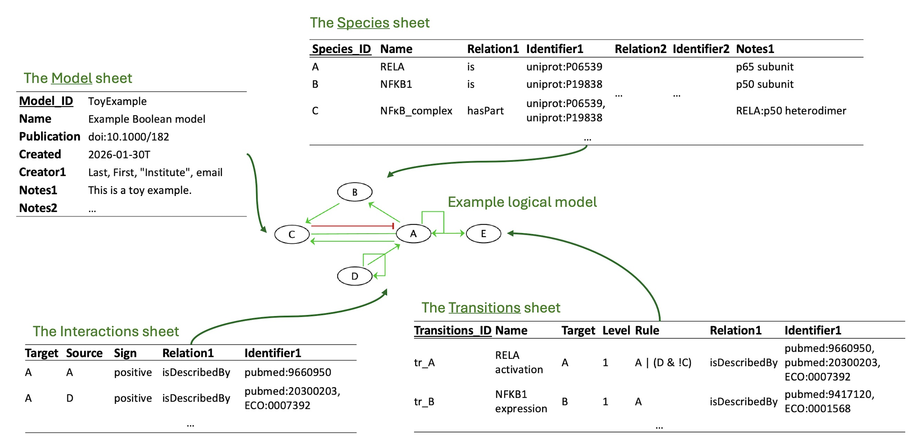

## TabularQual converter

Convert between spreadsheets and SBML-qual for logical models (Boolean and multi-valued).



Note: the format is specified [here](doc/specification.docx).


### Web App

Use directly in your browser - no installation required!

🔗 **[Launch Web App](https://tabularqual.streamlit.app/)**

Note: there are currently resource limits on Streamlit cloud, please run it locally for large networks.

---

### Install

#### Option 1: Run Web App Locally

```bash

# 1) Install dependencies
pip install -r requirements.txt

# 2) Launch the web app
streamlit run app.py
```

The app will open in your browser at `http://localhost:8501`

#### Option 2: Command-Line Tools

```bash
# Install dependencies and console script
pip install -r requirements.txt
pip install -e .
```

### Usage

#### Spreadsheet ➜ SBML

```bash
# Simple usage (output defaults to input name with .sbml extension)
to-sbml model.xlsx

# From XLSX with explicit output
to-sbml model.xlsx model_out.sbml

# From CSV files (using prefix - looks for Model_Species.csv, Model_Transitions.csv, etc.)
to-sbml Model

# From CSV directory
to-sbml examples/Faure2006/
```

#### SBML ➜ Spreadsheet

```bash
# Simple usage (output defaults to input name with .xlsx extension)
to-table model.sbml

# To XLSX with explicit output
to-table model.sbml output.xlsx

# To CSV files (creates Model_Model.csv, Model_Species.csv, etc.)
to-table model.sbml --csv

# To CSV with custom prefix
to-table model.sbml MyOutput --csv
```

### Options

`to-sbml INPUT [OUTPUT]`:

- **INPUT**: input file/path. Supports XLSX, CSV file, directory with CSVs, or CSV prefix (e.g., `Model` for `Model_Species.csv`, `Model_Transitions.csv`, etc.)
- **OUTPUT**: output SBML file (optional, defaults to input name with `.sbml` extension)
- **--inter-anno**: use interaction annotations only (unless `--trans-anno` is also set)
- **--trans-anno**: use transition annotations only (unless `--inter-anno` is also set)
- **--no-validate**: skip annotation validation
- If you pass both flags or neither, the converter includes **both** annotation types

`to-table INPUT [OUTPUT]`:

- **INPUT**: input SBML file
- **OUTPUT**: output file/prefix (optional, defaults to input name)
- **--csv**: output as CSV files (`{prefix}_Model.csv`, `{prefix}_Species.csv`, `{prefix}_Transitions.csv`, `{prefix}_Interactions.csv`)
- **--template**: specify a template file for README and Appendix sheets (XLSX only)
- **--colon-format**: use colon notation for transition rules (`:` means `>=`)
- **--no-validate**: skip annotation validation


### Transition Rules Syntax

The Transition-Rules column supports boolean and comparison expressions using the following operators and syntax (space will be ignored):

* **Logical operators**: `&` (AND), `|` (OR), `!` (NOT)
* **Parentheses**: `(` and `)` for grouping expressions
* **For multi-value model**: threshold-based activation:
  * **Colon notation**: `A:2` means "A is at level 2 or higher" (`A >= 2`)
  * **Negated colon**: `!A:2` means "A is below level 2" (`A < 2`)
  * **Explicit comparisons**: `A >= 2`, `B <= 1`, `C != 0` for precise control
  * **Equivalent expressions**: `!CI:2 & !Cro:3` is the same as `CI < 2 & Cro < 3` or `CI <= 1 & Cro <= 2`
* **Simple species references**:
  * `A` - Species A is active (level >= 1 for multi-valued, or level = 1 for binary)
  * `!A` - Species A is inactive (level = 0)
* **Species IDs with special characters**: Species IDs containing characters like `/`, `-`, or `\` (e.g., `PI3K/AKT`, `NF-kB`) are supported as long as they are defined in the Species sheet

**Examples**:

- `A & B` - Both A and B are active (level ≥ 1 for multi-valued)
- `A:2 | B < 1` - A is at level 2+ OR B is inactive
- `N & !CI:2 & !Cro:3` - N active AND CI below level 2 AND Cro below level 3
- `(A & B) | (!C & D != 1)` - Complex grouped expression


### Notes

- The reader ignores a first README sheet if present, and reads `Model`, `Species`, `Transitions`, and `Interactions`.
- The SBML to Spreadsheet converter automatically uses `doc/template.xlsx` if available for README and Appendix sheets (XLSX output only).
- Annotation validation uses `sbmlutils` . To install: `pip install sbmlutils>=0.9.6`.
- TODO: automatically detect Species:Type, Interactions:Target, Source and Sign.
