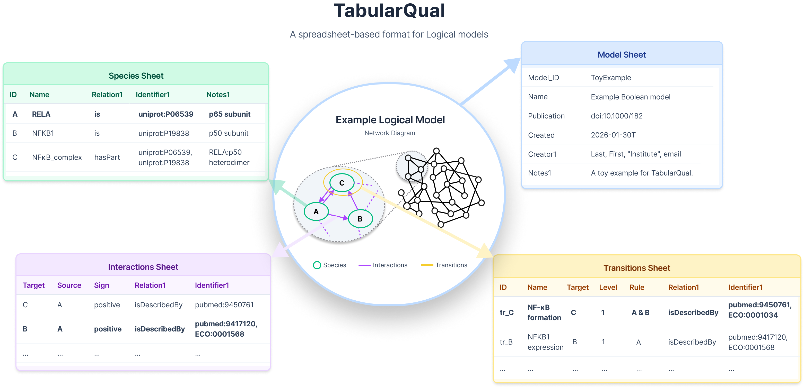

## TabularQual converter

Convert between spreadsheets (XLSX, CSV) and SBML-qual for logical models (Boolean and multi-valued).



Note: the format is specified [here](doc/TabularQual_specification_v0.1.2.docx).

### Web App

Use directly in your browser - no installation required!

🔗 **[Launch Web App](https://tabularqual.streamlit.app/)**

Note: there are currently resource limits on Streamlit cloud, please run it locally for large networks.

---

### Install

TabularQual can be installed directly from PyPI:

```bash
pip install tabularqual
```

Then use the command line tool.

...or, if you prefer an interface:

```
# Launch web app
streamlit run app.py
```

The app will open in your browser at `http://localhost:8501`

### Usage

#### Spreadsheet ➜ SBML

```bash
# Simple usage (output defaults to input name with .sbml extension)
to-sbml examples/ToyExample.xlsx

# From CSV directory
to-sbml examples/ToyExample_csv/

# From CSV files (using prefix - looks for Model_Species.csv, Model_Transitions.csv, etc.)
to-sbml Model
```

#### SBML ➜ Spreadsheet

```bash
# Simple usage (output defaults to input name with .xlsx extension)
to-table examples/ToyExample.sbml

# To CSV files (creates Model_Model.csv, Model_Species.csv, etc.)
to-table examples/ToyExample.sbml --csv
```

### Options

`to-sbml INPUT [OUTPUT]`:

- **INPUT**: input file/path. Supports XLSX, CSV file, directory with CSVs, or CSV prefix (e.g., `Model` for `Model_Species.csv`, `Model_Transitions.csv`, etc.)
- **OUTPUT**: output SBML file (optional, defaults to input name with `.sbml` extension)
- **--inter-anno**: use interaction annotations only (unless `--trans-anno` is also set)
- **--trans-anno**: use transition annotations only (unless `--inter-anno` is also set)
- **--use-name**: use Species Name instead of ID in rules and interactions (default: use ID)
- **--no-validate**: skip annotation validation

`to-table INPUT [OUTPUT]`:

- **INPUT**: input SBML file
- **OUTPUT**: output file/prefix (optional, defaults to input name)
- **--csv**: output as CSV files (`{prefix}_Model.csv`, `{prefix}_Species.csv`, `{prefix}_Transitions.csv`, `{prefix}_Interactions.csv`)
- **--template**: specify a template file for README and Appendix sheets (XLSX only)
- **--colon-format**: use colon notation for transition rules (`:` means `>=`)
- **--use-name**: use Species Name instead of ID in rules and interactions (default: use ID)
- **--no-validate**: skip annotation validation

### Transition Rules Syntax

The Transition-Rules column supports boolean and comparison expressions using the following operators and syntax (space will be ignored):

* **Logical operators**: `&` (AND), `|` (OR), `!` (NOT)
* **Parentheses**: `(` and `)` for grouping expressions
* **For multi-value model**: threshold-based activation:
  * **Colon notation**: `A:2` means "A is at level 2 or higher" (`A >= 2`)
  * **Negated colon**: `!A:2` means "A is below level 2" (`A < 2`)
  * **Explicit comparisons**: `A >= 2`, `B <= 1`, `C != 0` for precise control
  * **Equivalent expressions**: `!CI:2 & !Cro:3` is the same as `CI < 2 & Cro < 3` or `CI <= 1 & Cro <= 2`
* **Simple species references**:
  * `A` - Species A is active (level >= 1 for multi-valued, or level = 1 for binary)
  * `!A` - Species A is inactive (level = 0)

**Examples**:

- `A & B` - Both A and B are active (level ≥ 1 for multi-valued)
- `A:2 | B < 1` - A is at level 2+ OR B is inactive
- `N & !CI:2 & !Cro:3` - N active AND CI below level 2 AND Cro below level 3
- `(A & B) | (!C & D != 1)` - Complex grouped expression

### Validation

TabularQual performs several validations during conversion to ensure data quality and SBML compliance.

#### SId Format Validation

Model_ID, Species_ID, Transitions_ID, and Compartment fields must conform to the SBML SId specification (SBML Level 3 Version 2):

- Must start with a letter (A–Z, a–z) or underscore (`_`)
- May contain only letters, digits (0–9), and underscores
- Case-sensitive (equality determined by exact string matching)
- No spaces, slashes, or other special characters allowed
- Unique across their sheets

**Automatic Cleanup**: If an ID doesn't conform, it is automatically cleaned:

- Special characters (spaces, slashes, dashes, etc.) are replaced with underscores
- IDs starting with a digit get a leading underscore prepended
- Duplicate IDs are automatically renamed with suffixes (`_1`, `_2`, etc.)

**Example**: `PI3K/AKT-pathway` → `PI3K_AKT_pathway`

#### Field Value Validation

The converter validates controlled vocabulary fields:

- **Species Type**: Must be one of `Input`, `Internal`, or `Output` (case-insensitive)
- **Interaction Sign**: Must be one of `positive`, `negative`, `dual`, or `unknown` (case-insensitive)
- **Relation Qualifiers**: Must be one of `is`, `hasVersion`, `isVersionOf`, `isDescribedBy`, `hasPart`, `isPartOf`, `hasProperty`, `isPropertyOf`, `encodes`, `isEncodedBy`, `isHomologTo`, `occursIn`, `hasTaxon` (case-insensitive)
- TODO: validate Relation qualifiers in SBML.

#### Annotation Validation

Annotations in the SBML output can be validated using `sbmlutils`:

- Validates that annotation URIs are correctly formed
- Checks that identifiers.org resources are valid
- Enable/disable with `--no-validate` flag or checkbox in web app

To use annotation validation: `pip install sbmlutils>=0.9.6`

### Notes

- The reader ignores a first README sheet if present, and reads `Model`, `Species`, `Transitions`, and `Interactions`.
- The SBML to Spreadsheet converter automatically uses `doc/template.xlsx` if available for README and Appendix sheets (XLSX output only).
- When `--use-name` is enabled, the converter uses **Species Name** in transition rules and interactions instead of Species_ID.
  - If a name conforms to SId format and is unique, it's used directly. Otherwise, it's quoted: `"Name"` or gets suffixes for duplicates: `"Name_1"`, `"Name_2"`, etc.
  - If any species are missing Names when `--use-name` is enabled, a warning is issued and IDs are used instead.
  - When `--use-name` is enabled, Species_ID becomes optional and is automatically generated from Names if missing.
- TODO: automatically detect Species:Type
